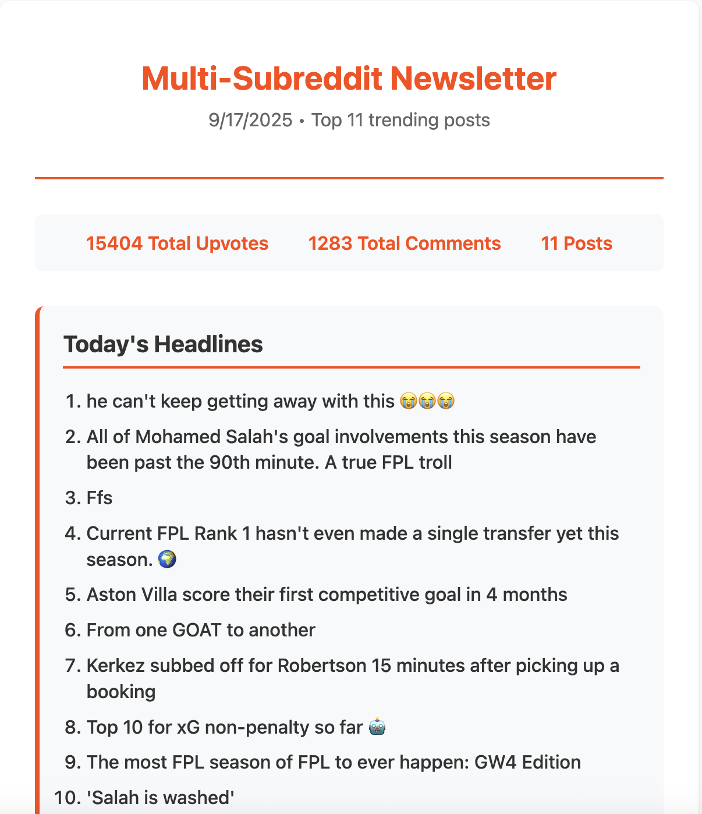

# Reddit Newsletter Bot

An automated newsletter generator that aggregates trending posts from multiple subreddits and creates beautiful HTML newsletters with AI-powered fantasy football analysis.

## 📧 Live Newsletter Example

**[View the Complete Newsletter Example →](https://raym26.github.io/reddit-newsletter-n8n-workflow/example-output.html)**



See the bot in action with a real-world example featuring 11 trending posts, engagement stats, and AI-powered fantasy football analysis.

## Features

- 🤖 **Automated Collection**: Scrapes trending posts from multiple subreddits
- 📊 **Smart Analytics**: Calculates total upvotes, comments, and engagement metrics
- 🧠 **AI Analysis**: Provides intelligent fantasy football insights and recommendations
- 📧 **Beautiful HTML**: Generates clean, responsive newsletter templates
- ⚡ **N8N Integration**: Built with N8N workflow automation

## Example Output

### Newsletter Stats
- **Total Posts**: 11 trending posts
- **Total Upvotes**: 15,404
- **Total Comments**: 1,283
- **AI Analysis**: Fantasy football strategy insights

### Sample Headlines
1. he can't keep getting away with this 😭😭😭
2. All of Mohamed Salah's goal involvements this season have been past the 90th minute. A true FPL troll
3. Current FPL Rank 1 hasn't even made a single transfer yet this season. 🌍
4. Aston Villa score their first competitive goal in 4 months

## Repository Structure

```
reddit-newsletter-n8n-workflow/
├── example-output.html                  # Complete HTML newsletter example
├── workflows/
│   └── reddit-newsletter.json           # N8N workflow configuration
├── templates/
│   └── newsletter-template.html         # Base HTML template
├── docs/
│   ├── setup.md                        # Setup instructions
│   └── configuration.md                # Configuration guide
└── README.md                           # This file
```

## Quick Start

1. **Clone the repository**
   ```bash
   git clone https://github.com/yourusername/reddit-newsletter-bot.git
   cd reddit-newsletter-bot
   ```

2. **Import N8N Workflow**
   - Open your N8N instance
   - Import the workflow from `workflows/reddit-newsletter.json`
   - Configure your Reddit API credentials

3. **Customize Settings**
   - Edit subreddit list
   - Adjust post filtering criteria
   - Configure email delivery settings

## Configuration

### Subreddits
Configure which subreddits to monitor in your N8N workflow:
- r/FantasyPL
- r/soccer
- r/PremierLeague
- (Add your preferred subreddits)

### AI Analysis
The bot includes intelligent analysis features:
- Player performance insights
- Transfer recommendations
- Gameweek strategies
- Data-driven predictions

## Example Newsletter

**[🔗 Live Demo](https://raym26.github.io/reddit-newsletter-n8n-workflow/example-output.html)** | [View Source](example-output.html)

The newsletter includes:
- Clean, responsive design
- Organized post summaries
- AI-powered fantasy analysis
- Direct links to original Reddit posts
- Engagement statistics

## Technical Details

### Data Structure
```json
{
  "html_newsletter": "Complete HTML content",
  "subject_line": "Email subject with stats",
  "preview_text": "Email preview snippet"
}
```

### Styling Features
- Reddit-inspired color scheme (#ff4500)
- Mobile-responsive design
- Clean typography
- Organized sections
- Hover effects and interactions

## Use Cases

- **Fantasy Football Managers**: Stay updated on player news and community insights
- **Reddit Community Managers**: Monitor trending discussions across subreddits
- **Content Creators**: Aggregate popular content for research and inspiration
- **Data Analysts**: Track engagement patterns and trending topics

## Contributing

1. Fork the repository
2. Create a feature branch
3. Make your changes
4. Submit a pull request

## License

MIT License - feel free to modify and distribute

## Support

For issues and questions:
- Create an issue in this repository
- Check the documentation in `/docs`
- Review the example newsletter for implementation details

---

**Generated automatically by N8N Reddit Newsletter Bot**  
*Powered by Reddit API • Enhanced with AI Analysis*
